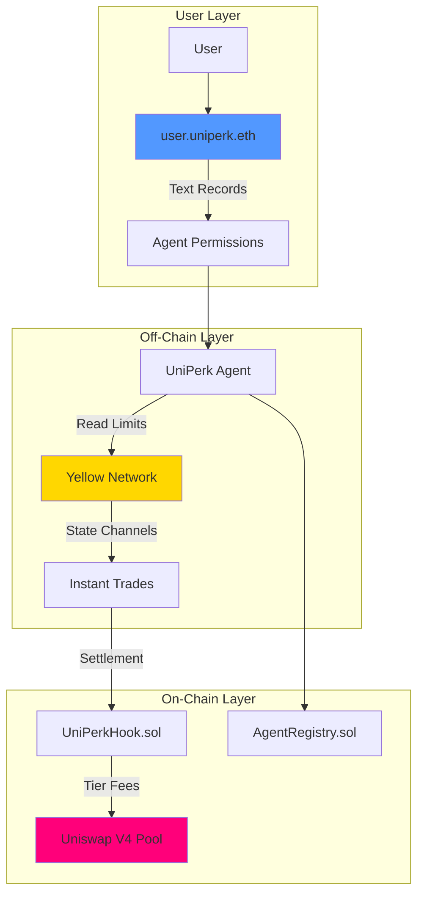

# UniPerk 🦄

**Trust Layer for DeFi** — Portable identity, instant execution, smart settlement.

> *Imagine giving an AI agent access to trade on your behalf. Now imagine it drains your entire wallet because you could not set limits. That is the reality today. We fixed it.*

## The Problem

AI agents are coming to DeFi. But right now:

- **No Identity**: Agents are just anonymous wallets — no way to know if they're trustworthy
- **Gas Inefficiency**: 100 micro-trades = 100 gas fees. Economically inviable.
- **All or Nothing Permissions**: Give full wallet access or nothing — no middle ground
- **Repetitive Configuration**: Every dApp asks for the same settings over and over

## The Solution

UniPerk combines three protocols to create the first complete infrastructure for AI agents in DeFi:

| Protocol | Innovation | Value |
|----------|------------|-------|
| **ENS** | Agent Permission System | Configure once, trade everywhere |
| **Yellow Network** | State Channels | 100 trades, 1 settlement (99% gas savings) |
| **Uniswap V4** | Identity-Aware Hooks | Better reputation = better rates |

## Deployed Contracts (Base Mainnet)

Both contracts are **verified** ✅ on BaseScan — click to view source code:

| Contract | Address | Verified |
|----------|---------|----------|
| **AgentRegistry** | [`0xd5A14b5dA79Abb78a5B307eC28E9d9711cdd5cEF`](https://basescan.org/address/0xd5A14b5dA79Abb78a5B307eC28E9d9711cdd5cEF#code) | ✅ [View Code](https://basescan.org/address/0xd5A14b5dA79Abb78a5B307eC28E9d9711cdd5cEF#code) |
| **UniPerkHook** | [`0x825Fc7Ac1E5456674D7dBbB4D12467E8253740C0`](https://basescan.org/address/0x825Fc7Ac1E5456674D7dBbB4D12467E8253740C0#code) | ✅ [View Code](https://basescan.org/address/0x825Fc7Ac1E5456674D7dBbB4D12467E8253740C0#code) |

### Live Pool

| Pool | Fee | Hook |
|------|-----|------|
| WETH/USDC | 0.30% | UniPerkHook (tier discounts enabled) |

### External Contracts (Base Mainnet)

| Contract | Address |
|----------|---------|
| PoolManager (V4) | `0x498581fF718922c3f8e6A244956aF099B2652b2b` |
| PositionManager (V4) | `0x7C5f5A4bBd8fD63184577525326123B519429bDc` |
| Permit2 | `0x000000000022D473030F116dDEE9F6B43aC78BA3` |
| WETH | `0x4200000000000000000000000000000000000006` |
| USDC | `0x833589fCD6eDb6E08f4c7C32D4f71b54bdA02913` |

## Architecture



## ENS Text Records (DeFi DNA)

Users configure agent permissions via ENS text records on their `user.uniperk.eth` subdomain:

| Record | Example | Description |
|--------|---------|-------------|
| `agent.uniperk.allowed` | `true` | Enable/disable agent trading |
| `agent.uniperk.maxTrade` | `1000` | Max trade size in USDC |
| `agent.uniperk.tokens` | `ETH,USDC` | Comma-separated allowed tokens |
| `agent.uniperk.slippage` | `50` | Max slippage in basis points |
| `agent.uniperk.expires` | `1707609600` | Unix timestamp for permission expiry |

## Tier System

Agents build reputation through successful trades, unlocking progressive fee discounts:

| Tier | Trades | Fee Discount |
|------|--------|--------------|
| 🥉 Bronze | 0-9 | 0% |
| 🥈 Silver | 10-49 | 1% |
| 🥇 Gold | 50-199 | 3% |
| 💎 Platinum | 200+ | 5% |

## Project Structure

```
UniPerk/
├── app/                        # Next.js 14 Frontend
│   ├── app/
│   │   ├── page.tsx            # Landing page
│   │   ├── dashboard/          # User dashboard
│   │   └── configure/          # ENS permissions config
│   ├── components/
│   │   ├── ui/                 # shadcn components
│   │   ├── tier-badge.tsx
│   │   ├── permission-card.tsx
│   │   └── ens-config-form.tsx
│   ├── hooks/
│   │   ├── useUserTier.ts
│   │   └── useENSPermissions.ts
│   └── lib/
│       ├── wagmi.ts
│       └── contracts.ts
│
├── contracts/                  # Smart Contracts (Foundry)
│   ├── src/
│   │   ├── AgentRegistry.sol
│   │   ├── UniPerkHook.sol
│   │   └── interfaces/
│   ├── script/
│   └── foundry.toml
│
├── agent/                      # OpenClaw agent config
│   ├── openclaw.json
│   ├── SOUL.md
│   └── skills/
│       └── yellow-sdk/
│
├── scripts/                    # Utility scripts
│   ├── setup-wallet.sh
│   ├── deploy.sh
│   └── fund-agent.sh
│
└── README.md
```

## Tech Stack

| Component | Technology |
|-----------|------------|
| Frontend | Next.js 14, wagmi, viem, RainbowKit |
| Smart Contracts | Solidity 0.8.26, Foundry |
| V4 Integration | @openzeppelin/uniswap-hooks |
| ENS | @ensdomains/ensjs |
| Yellow | @erc7824/nitrolite |
| Agent | OpenClaw |

## Getting Started

### Prerequisites

- Node.js 18+
- [Foundry](https://book.getfoundry.sh/getting-started/installation)

### Installation

```bash
git clone https://github.com/PerkOS-xyz/UniPerk.git
cd UniPerk

# Install contract dependencies
cd contracts
forge install

# Install frontend dependencies
cd ../app
npm install
```

### Run Frontend

```bash
cd app
npm run dev
```

### Build & Test Contracts

```bash
cd contracts
forge build
forge test
```

### Deploy

```bash
cd contracts

# Deploy hook
forge script script/00_DeployUniPerkHook.s.sol --rpc-url base --broadcast

# Create pool
forge script script/UniPerk_CreatePool.s.sol --rpc-url base --broadcast

# Add liquidity
forge script script/UniPerk_AddLiquidity.s.sol --rpc-url base --broadcast
```

## How It Works

1. **User sets permissions** via ENS text records (maxTrade, slippage, tokens)
2. **User deposits USDC** to Yellow Network (Nitrolite)
3. **Agent reads permissions** from ENS before trading
4. **Trades execute instantly** via Yellow state channels
5. **Settlement happens on-chain** through UniPerkHook
6. **Tier updates automatically** based on trade count

## Why This Matters

- **85%** of DeFi users abandon due to configuration complexity
- **$2.3B** lost in 2025 to malicious agents or bugs
- **$15-50** average gas cost for multi-step strategies

UniPerk solves all three: one configuration, instant execution, trustless control.

## License

MIT
