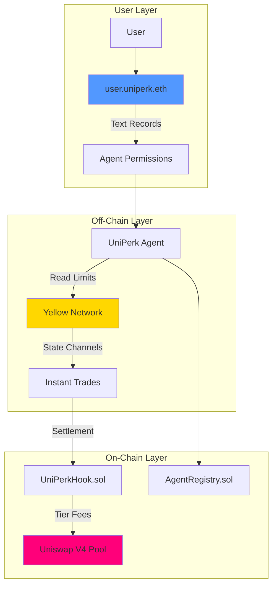
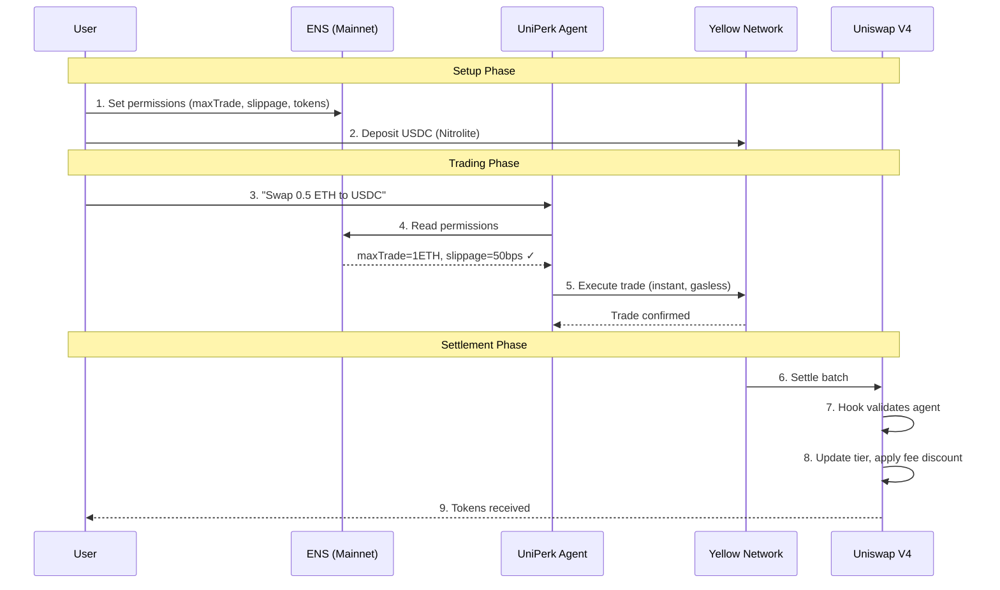

# UniPerk 🦄

**Trust Layer for DeFi** — Portable identity, instant execution, smart settlement.

> *Imagine giving an AI agent access to trade on your behalf. Now imagine it drains your entire wallet because you could not set limits. That is the reality today. We fixed it.*

## The Problem

AI agents are coming to DeFi. But right now:

- **No Identity**: Agents are just anonymous wallets — no way to know if they're trustworthy
- **Gas Inefficiency**: 100 micro-trades = 100 gas fees. Economically inviable.
- **All or Nothing Permissions**: Give full wallet access or nothing — no middle ground
- **Repetitive Configuration**: Every dApp asks for the same settings over and over

## The Solution

UniPerk combines three protocols to create the first complete infrastructure for AI agents in DeFi:

| Protocol | Innovation | Value |
|----------|------------|-------|
| **ENS** | Agent Permission System | Configure once, trade everywhere |
| **Yellow Network** | State Channels | 100 trades, 1 settlement (99% gas savings) |
| **Uniswap V4** | Identity-Aware Hooks | Better reputation = better rates |

## Deployed Contracts (Base Mainnet)

| Contract | Address | Description |
|----------|---------|-------------|
| **AgentRegistry** | [`0xd5A14b5dA79Abb78a5B307eC28E9d9711cdd5cEF`](https://basescan.org/address/0xd5A14b5dA79Abb78a5B307eC28E9d9711cdd5cEF) | On-chain agent registry with trade limits |
| **UniPerkHook** | [`0x825Fc7Ac1E5456674D7dBbB4D12467E8253740C0`](https://basescan.org/address/0x825Fc7Ac1E5456674D7dBbB4D12467E8253740C0) | V4 hook with tier-based fee discounts |

### Live Pool

| Pool | Fee | Hook |
|------|-----|------|
| WETH/USDC | 0.30% | UniPerkHook (tier discounts enabled) |

### External Contracts (Base Mainnet)

| Contract | Address |
|----------|---------|
| PoolManager (V4) | `0x498581fF718922c3f8e6A244956aF099B2652b2b` |
| PositionManager (V4) | `0x7C5f5A4bBd8fD63184577525326123B519429bDc` |
| Permit2 | `0x000000000022D473030F116dDEE9F6B43aC78BA3` |
| WETH | `0x4200000000000000000000000000000000000006` |
| USDC | `0x833589fCD6eDb6E08f4c7C32D4f71b54bdA02913` |

## Architecture



## User Workflow



## ENS Text Records (DeFi DNA)

Users configure agent permissions via ENS text records on their `user.uniperk.eth` subdomain:

| Record | Example | Description |
|--------|---------|-------------|
| `agent.uniperk.allowed` | `true` | Enable/disable agent trading |
| `agent.uniperk.maxTrade` | `1000` | Max trade size in USDC |
| `agent.uniperk.tokens` | `ETH,USDC` | Comma-separated allowed tokens |
| `agent.uniperk.slippage` | `50` | Max slippage in basis points |
| `agent.uniperk.expires` | `1707609600` | Unix timestamp for permission expiry |

## Tier System

Agents build reputation through successful trades, unlocking progressive fee discounts:

| Tier | Trades | Fee Discount |
|------|--------|--------------|
| 🥉 Bronze | 0-9 | 0% |
| 🥈 Silver | 10-49 | 10% |
| 🥇 Gold | 50-199 | 25% |
| 💎 Platinum | 200+ | 50% |

## Smart Contracts

### AgentRegistry.sol

ENS hybrid identity system with on-chain fallback. Manages agent permissions and trade limits.

```solidity
function registerAgent(address agent, uint256 limit, string ensName)
function validateTrade(address agent, uint256 size) → bool
function revokeAgent(address agent)
```

### UniPerkHook.sol

Uniswap V4 hook implementing identity-aware fee discounts based on trader reputation.

```solidity
function _beforeSwap() → validates agent, applies tier discount
function _afterSwap() → updates trade count, promotes tier
```

#### V4 Hook Address Requirements

Uniswap V4 uses **address-encoded permissions** where the hook's address must contain specific bits corresponding to its enabled callbacks. For production deployment:

1. Use `CREATE2` with a mined salt via [HookMiner](https://github.com/uniswap/v4-periphery)
2. The address bits must match `getHookPermissions()` return value
3. This demo overrides `validateHookAddress()` for rapid iteration

## Project Structure

```
UniPerk/
├── app/                    # Next.js frontend
│   ├── app/
│   ├── components/
│   └── package.json
│
├── contracts/              # AgentRegistry (Hardhat)
│   ├── contracts/
│   │   ├── AgentRegistry.sol
│   │   └── interfaces/
│   └── hardhat.config.js
│
├── contracts-v4/           # UniPerkHook (Foundry)
│   ├── src/
│   │   ├── UniPerkHook.sol
│   │   └── interfaces/
│   ├── script/
│   │   ├── 00_DeployUniPerkHook.s.sol
│   │   ├── UniPerk_CreatePool.s.sol
│   │   └── UniPerk_AddLiquidity.s.sol
│   ├── lib/                # Foundry dependencies
│   └── foundry.toml
│
├── agent/                  # OpenClaw agent config
│   ├── openclaw.json
│   └── skills/
│
└── scripts/                # Setup and deployment
```

## Tech Stack

| Component | Technology |
|-----------|------------|
| Frontend | Next.js 14, wagmi, viem |
| AgentRegistry | Solidity 0.8.24, Hardhat |
| UniPerkHook | Solidity 0.8.26, Foundry |
| V4 Integration | @openzeppelin/uniswap-hooks, HookMiner |
| ENS | @ensdomains/ensjs, NameStone |
| Yellow | @erc7824/nitrolite v0.5.3 |
| Uniswap | v4-core, v4-periphery |
| Agent | OpenClaw |
| Payments | x402 via stack.perkos.xyz |

## Getting Started

### Prerequisites

- Node.js 18+
- Git
- [Foundry](https://book.getfoundry.sh/getting-started/installation)

### Installation

```bash
# Clone the repository
git clone https://github.com/PerkOS-xyz/UniPerk.git
cd UniPerk

# Install AgentRegistry dependencies (Hardhat)
cd contracts
npm install

# Install UniPerkHook dependencies (Foundry)
cd ../contracts-v4
forge install

# Install frontend dependencies
cd ../app
npm install
```

### Build & Test

```bash
# Build AgentRegistry (Hardhat)
cd contracts
npx hardhat compile

# Build UniPerkHook (Foundry)
cd ../contracts-v4
forge build

# Run Foundry tests
forge test
```

### Deploy to Base Mainnet

```bash
cd contracts-v4

# Deploy UniPerkHook (uses HookMiner for correct address)
forge script script/00_DeployUniPerkHook.s.sol --rpc-url base --broadcast

# Create pool
forge script script/UniPerk_CreatePool.s.sol --rpc-url base --broadcast

# Add liquidity
forge script script/UniPerk_AddLiquidity.s.sol --rpc-url base --broadcast
```

## Why This Matters

- **85%** of DeFi users abandon due to configuration complexity
- **$2.3B** lost in 2025 to malicious agents or bugs
- **$15-50** average gas cost for multi-step strategies

UniPerk solves all three: one configuration, instant execution, trustless control.

## Team

Built for [ETH Global Hack The Money 2026](https://ethglobal.com/events/hackmoney2026)

## License

MIT
