# UniPerk 🦄

**Trust Layer for DeFi** — Portable identity, instant execution, smart settlement.

> *Imagine giving an AI agent access to trade on your behalf. Now imagine it drains your entire wallet because you could not set limits. That is the reality today. We fixed it.*

## The Problem

AI agents are coming to DeFi. But right now:

- **No Identity**: Agents are just anonymous wallets — no way to know if they're trustworthy
- **Gas Inefficiency**: 100 micro-trades = 100 gas fees. Economically inviable.
- **All or Nothing Permissions**: Give full wallet access or nothing — no middle ground
- **Repetitive Configuration**: Every dApp asks for the same settings over and over

## The Solution

UniPerk combines three protocols to create the first complete infrastructure for AI agents in DeFi:

| Protocol | Innovation | Value |
|----------|------------|-------|
| **ENS** | Agent Permission System | Configure once, trade everywhere |
| **Yellow Network** | State Channels | 100 trades, 1 settlement (99% gas savings) |
| **Uniswap V4** | Identity-Aware Hooks | Better reputation = better rates |

## Architecture


## User Workflow

```mermaid
sequenceDiagram
    participant User
    participant ENS as ENS (Mainnet)
    participant Agent as UniPerk Agent
    participant Yellow as Yellow Network
    participant V4 as Uniswap V4

    Note over User,V4: Setup Phase
    User->>ENS: 1. Set permissions (maxTrade, slippage, tokens)
    User->>Yellow: 2. Deposit USDC (Nitrolite)

    Note over User,V4: Trading Phase
    User->>Agent: 3. "Swap 0.5 ETH to USDC"
    Agent->>ENS: 4. Read permissions
    ENS-->>Agent: maxTrade=1ETH, slippage=50bps ✓
    Agent->>Yellow: 5. Execute trade (instant, gasless)
    Yellow-->>Agent: Trade confirmed

    Note over User,V4: Settlement Phase
    Yellow->>V4: 6. Settle batch
    V4->>V4: 7. Hook validates agent
    V4->>V4: 8. Update tier, apply fee discount
    V4-->>User: 9. Tokens received
```



## ENS Text Records (DeFi DNA)

Users configure agent permissions via ENS text records on their `user.uniperk.eth` subdomain:

| Record | Example | Description |
|--------|---------|-------------|
| `agent.uniperk.allowed` | `true` | Enable/disable agent trading |
| `agent.uniperk.maxTrade` | `1000` | Max trade size in USDC |
| `agent.uniperk.tokens` | `ETH,USDC` | Comma-separated allowed tokens |
| `agent.uniperk.slippage` | `50` | Max slippage in basis points |
| `agent.uniperk.expires` | `1707609600` | Unix timestamp for permission expiry |

## Tier System

Agents build reputation through successful trades, unlocking progressive fee discounts:

| Tier | Trades | Fee Discount |
|------|--------|--------------|
| 🥉 Bronze | 0-9 | 0% |
| 🥈 Silver | 10-49 | 10% |
| 🥇 Gold | 50-199 | 25% |
| 💎 Platinum | 200+ | 50% |

## Project Structure

```
UniPerk/
├── app/                    # Next.js frontend
│   ├── app/
│   ├── components/
│   └── package.json
│
├── contracts/              # Solidity smart contracts
│   ├── src/
│   │   ├── AgentRegistry.sol    # ENS hybrid identity
│   │   └── UniPerkHook.sol      # V4 hook with tier fees
│   ├── script/
│   │   └── Deploy.s.sol
│   ├── test/
│   └── foundry.toml
│
├── agent/                  # OpenClaw agent config
│   ├── openclaw.json
│   └── skills/             # Yellow SDK, ENS reader
│
└── scripts/                # Setup and deployment
```

## Smart Contracts

### AgentRegistry.sol
ENS hybrid identity system with on-chain fallback.

```solidity
function registerAgent(address agent, uint256 limit, string ensName)
function validateTrade(address agent, uint256 size) → bool
```

### UniPerkHook.sol
Uniswap V4 hook with identity-aware fee discounts.

```solidity
function beforeSwap() → validates agent, applies tier discount
function afterSwap() → updates trade count, promotes tier
```

## Tech Stack

| Component | Technology |
|-----------|------------|
| Frontend | Next.js 14, wagmi, viem |
| Contracts | Solidity 0.8.24, Foundry |
| ENS | @ensdomains/ensjs, NameStone |
| Yellow | @erc7824/nitrolite v0.5.3 |
| Uniswap | v4-core, v4-periphery |
| Agent | OpenClaw |
| Payments | x402 via stack.perkos.xyz |

## Network

**Base Mainnet** (Chain ID: 8453)

### Contract Addresses

| Contract | Address |
|----------|---------|
| PoolManager (V4) | `0x498581ff718922c3f8e6a244956af099b2652b2b` |
| PositionManager (V4) | `0x7c5f5a4bbd8fd63184577525326123b519429bdc` |
| Nitrolite Custody | `0x490fb189DdE3a01B00be9BA5F41e3447FbC838b6` |
| Nitrolite Adjudicator | `0x7de4A0736Cf5740fD3Ca2F2e9cc85c9AC223eF0C` |
| USDC | `0x833589fCD6eDb6E08f4c7c32D4f71b54bdA02913` |

## Getting Started

### Prerequisites

- Node.js 18+
- Foundry
- Git

### Installation

```bash
# Clone the repository
git clone https://github.com/PerkOS-xyz/UniPerk.git
cd UniPerk

# Install contract dependencies
cd contracts
forge install

# Install frontend dependencies
cd ../app
npm install
```

### Build & Test

```bash
# Build contracts
cd contracts
forge build

# Run tests
forge test

# Deploy to Base
forge script script/Deploy.s.sol --rpc-url base --broadcast
```

## Bounties

| Protocol | Prize | Track |
|----------|-------|-------|
| Uniswap V4 | $2,500 | Agentic Finance |
| ENS | $1,500 | Most Creative DeFi |
| Yellow Network | $5,000 | Trading Apps |

**Total Potential: $9,000**

## Why This Matters

- **85%** of DeFi users abandon due to configuration complexity
- **$2.3B** lost in 2025 to malicious agents or bugs
- **$15-50** average gas cost for multi-step strategies

UniPerk solves all three: one configuration, instant execution, trustless control.

## Team

Built for [ETH Global Hack The Money 2026](https://ethglobal.com/events/hackmoney2026)

## License

MIT
