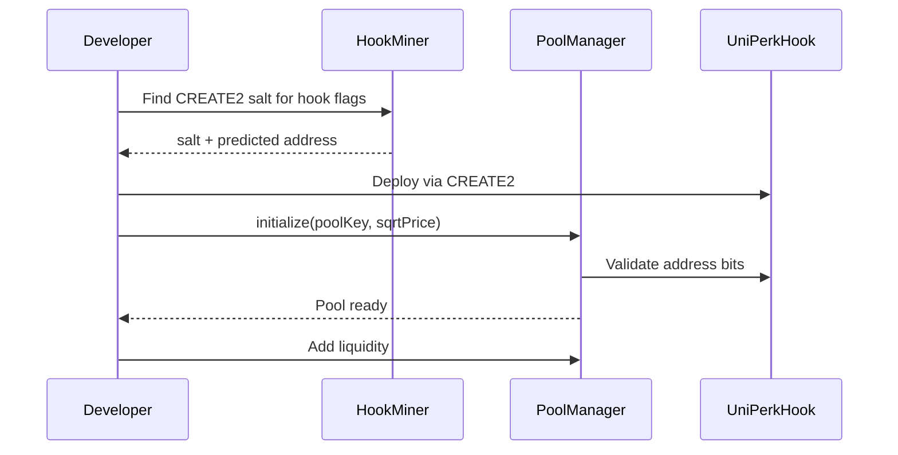

# UniPerk 🦄

**Trust Layer for DeFi** — Portable identity, instant execution, smart settlement.

> *Imagine giving an AI agent access to trade on your behalf. Now imagine it drains your entire wallet because you could not set limits. That is the reality today. We fixed it.*

## The Problem

AI agents are coming to DeFi. But right now:

- **No Identity**: Agents are just anonymous wallets — no way to know if they're trustworthy
- **Gas Inefficiency**: 100 micro-trades = 100 gas fees. Economically inviable.
- **All or Nothing Permissions**: Give full wallet access or nothing — no middle ground
- **Repetitive Configuration**: Every dApp asks for the same settings over and over

## The Solution

UniPerk combines three protocols to create the first complete infrastructure for AI agents in DeFi:

| Protocol | Innovation | Value |
|----------|------------|-------|
| **ENS** | Agent Permission System | Configure once, trade everywhere |
| **Yellow Network** | State Channels | 100 trades, 1 settlement (99% gas savings) |
| **Uniswap V4** | Identity-Aware Hooks | Better reputation = better rates |

## Deployed Contracts (Base Mainnet)

Both contracts are **verified** ✅ on BaseScan — click to view source code:

| Contract | Address | Verified |
|----------|---------|----------|
| **AgentRegistry** | [`0xd5A14b5dA79Abb78a5B307eC28E9d9711cdd5cEF`](https://basescan.org/address/0xd5A14b5dA79Abb78a5B307eC28E9d9711cdd5cEF#code) | ✅ [View Code](https://basescan.org/address/0xd5A14b5dA79Abb78a5B307eC28E9d9711cdd5cEF#code) |
| **UniPerkHook** | [`0x825Fc7Ac1E5456674D7dBbB4D12467E8253740C0`](https://basescan.org/address/0x825Fc7Ac1E5456674D7dBbB4D12467E8253740C0#code) | ✅ [View Code](https://basescan.org/address/0x825Fc7Ac1E5456674D7dBbB4D12467E8253740C0#code) |

> 💡 **AgentRegistry**: On-chain agent permissions with trade limits  
> 💡 **UniPerkHook**: Uniswap V4 hook with tier-based fee discounts

### Live Pool

| Pool | Fee | Hook |
|------|-----|------|
| WETH/USDC | 0.30% | UniPerkHook (tier discounts enabled) |

### External Contracts (Base Mainnet)

| Contract | Address |
|----------|---------|
| PoolManager (V4) | `0x498581fF718922c3f8e6A244956aF099B2652b2b` |
| PositionManager (V4) | `0x7C5f5A4bBd8fD63184577525326123B519429bDc` |
| Permit2 | `0x000000000022D473030F116dDEE9F6B43aC78BA3` |
| WETH | `0x4200000000000000000000000000000000000006` |
| USDC | `0x833589fCD6eDb6E08f4c7C32D4f71b54bdA02913` |

## Architecture


## User Workflow

```mermaid
sequenceDiagram
    participant User
    participant ENS as ENS (Mainnet)
    participant Agent as UniPerk Agent
    participant Yellow as Yellow Network
    participant V4 as Uniswap V4

    Note over User,V4: Setup Phase
    User->>ENS: 1. Set permissions (maxTrade, slippage, tokens)
    User->>Yellow: 2. Deposit USDC (Nitrolite)

    Note over User,V4: Trading Phase
    User->>Agent: 3. "Swap 0.5 ETH to USDC"
    Agent->>ENS: 4. Read permissions
    ENS-->>Agent: maxTrade=1ETH, slippage=50bps ✓
    Agent->>Yellow: 5. Execute trade (instant, gasless)
    Yellow-->>Agent: Trade confirmed

    Note over User,V4: Settlement Phase
    Yellow->>V4: 6. Settle batch
    V4->>V4: 7. Hook validates agent
    V4->>V4: 8. Update tier, apply fee discount
    V4-->>User: 9. Tokens received
```



## ENS Text Records (DeFi DNA)

Users configure agent permissions via ENS text records on their `user.uniperk.eth` subdomain:

| Record | Example | Description |
|--------|---------|-------------|
| `agent.uniperk.allowed` | `true` | Enable/disable agent trading |
| `agent.uniperk.maxTrade` | `1000` | Max trade size in USDC |
| `agent.uniperk.tokens` | `ETH,USDC` | Comma-separated allowed tokens |
| `agent.uniperk.slippage` | `50` | Max slippage in basis points |
| `agent.uniperk.expires` | `1707609600` | Unix timestamp for permission expiry |

## Tier System

Agents build reputation through successful trades, unlocking progressive fee discounts:

| Tier | Trades | Fee Discount |
|------|--------|--------------|
| 🥉 Bronze | 0-9 | 0% |
| 🥈 Silver | 10-49 | 10% |
| 🥇 Gold | 50-199 | 25% |
| 💎 Platinum | 200+ | 50% |

## Smart Contracts

### AgentRegistry.sol

ENS hybrid identity system with on-chain fallback. Manages agent permissions and trade limits.

```solidity
function registerAgent(address agent, uint256 limit, string ensName)
function validateTrade(address agent, uint256 size) → bool
function revokeAgent(address agent)
```

### UniPerkHook.sol

Uniswap V4 hook implementing identity-aware fee discounts based on trader reputation.

```solidity
function _beforeSwap() → validates agent, applies tier discount
function _afterSwap() → updates trade count, promotes tier
```

#### V4 Hook Address Requirements

Uniswap V4 uses **address-encoded permissions** where the hook's address must contain specific bits corresponding to its enabled callbacks. For production deployment:

1. Use `CREATE2` with a mined salt via [HookMiner](https://github.com/uniswap/v4-periphery)
2. The address bits must match `getHookPermissions()` return value
3. This demo overrides `validateHookAddress()` for rapid iteration

## Project Structure

```
UniPerk/
├── app/                    # Next.js frontend
│   ├── app/
│   ├── components/
│   └── package.json
│
├── contracts-v4/           # Smart Contracts (Foundry)
│   ├── src/
│   │   ├── UniPerkHook.sol
│   │   └── interfaces/
│   │       └── IAgentRegistry.sol
│   ├── script/
│   │   ├── 00_DeployUniPerkHook.s.sol
│   │   ├── UniPerk_CreatePool.s.sol
│   │   └── UniPerk_AddLiquidity.s.sol
│   ├── lib/                # Foundry dependencies
│   └── foundry.toml
│
├── agent/                  # OpenClaw agent config
│   ├── openclaw.json
│   └── skills/
│
└── docs/                   # Documentation
```

## Tech Stack

| Component | Technology |
|-----------|------------|
| Frontend | Next.js 14, wagmi, viem |
| Smart Contracts | Solidity 0.8.26, Foundry |
| V4 Integration | @openzeppelin/uniswap-hooks, HookMiner |
| ENS | @ensdomains/ensjs, NameStone |
| Yellow | @erc7824/nitrolite v0.5.3 |
| Uniswap | v4-core, v4-periphery |
| Agent | OpenClaw |
| Payments | x402 via stack.perkos.xyz |

## Getting Started

### Prerequisites

- Node.js 18+
- Git
- [Foundry](https://book.getfoundry.sh/getting-started/installation)

### Installation

```bash
# Clone the repository
git clone https://github.com/PerkOS-xyz/UniPerk.git
cd UniPerk

# Install smart contract dependencies
cd contracts-v4
forge install

# Install frontend dependencies
cd ../app
npm install
```

### Build & Test

```bash
cd contracts-v4

# Build contracts
forge build

# Run tests
forge test
```

### Deploy to Base Mainnet

```mermaid
flowchart LR
    subgraph Step 1: Deploy Hook
        MINE[🔨 HookMiner] --> |Find valid salt| SALT[Salt + Address]
        SALT --> |CREATE2| HOOK[UniPerkHook]
    end

    subgraph Step 2: Create Pool
        HOOK --> |Register hook| PM[PoolManager]
        PM --> |Initialize| POOL[WETH/USDC Pool]
    end

    subgraph Step 3: Add Liquidity
        POOL --> |Permit2 approve| P2[Permit2]
        P2 --> |Mint position| POS[PositionManager]
        POS --> |LP tokens| LP[Liquidity Added ✅]
    end

    style HOOK fill:#FF007A
    style POOL fill:#5298FF
    style LP fill:#00C853
```



**Why HookMiner?** Uniswap V4 validates hooks by address bits. The hook address must encode its permissions (beforeSwap, afterSwap). HookMiner finds a CREATE2 salt that produces a valid address.

```bash
cd contracts-v4

# Step 1: Deploy UniPerkHook (mines address + deploys)
forge script script/00_DeployUniPerkHook.s.sol --rpc-url base --broadcast

# Step 2: Create pool with hook
forge script script/UniPerk_CreatePool.s.sol --rpc-url base --broadcast

# Step 3: Add liquidity
forge script script/UniPerk_AddLiquidity.s.sol --rpc-url base --broadcast
```

## How It Works

### Hook Fee Logic

The hook calculates fee discounts dynamically based on user tier:

```solidity
function _beforeSwap(
    address sender,
    PoolKey calldata key,
    SwapParams calldata params,
    bytes calldata hookData
) internal override returns (bytes4, BeforeSwapDelta, uint24) {
    // Validate agent permissions
    (address agent, address user) = _decodeHookData(hookData);
    if (agent != address(0)) {
        (bool valid, ) = agentRegistry.validateTrade(agent, tradeSize);
        require(valid, "Agent validation failed");
    }
    
    // Apply tier discount to pool fee
    uint24 baseFee = key.fee;
    uint24 discountBps = tierFeeDiscount[userTier[trader]];
    uint24 feeOverride = baseFee - uint24((uint256(baseFee) * discountBps) / 10000);
    
    return (BaseHook.beforeSwap.selector, BeforeSwapDeltaLibrary.ZERO_DELTA, feeOverride);
}
```

### Deployment Flow



---

## Why This Matters

- **85%** of DeFi users abandon due to configuration complexity
- **$2.3B** lost in 2025 to malicious agents or bugs
- **$15-50** average gas cost for multi-step strategies

UniPerk solves all three: one configuration, instant execution, trustless control.

## Team

Built for [ETH Global Hack The Money 2026](https://ethglobal.com/events/hackmoney2026)

## License

MIT
